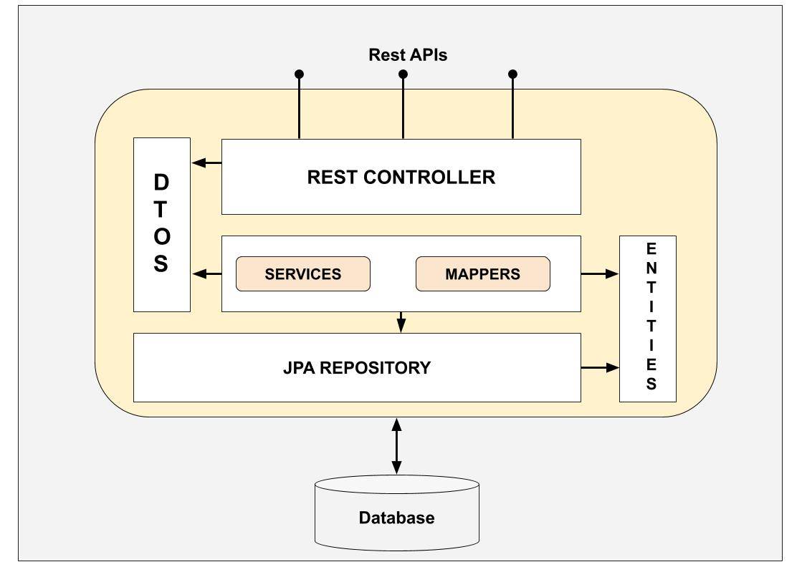
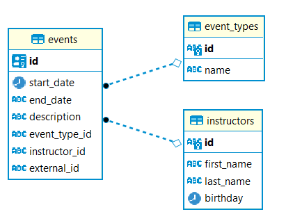
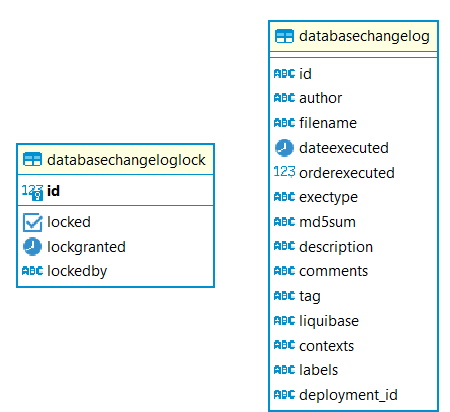
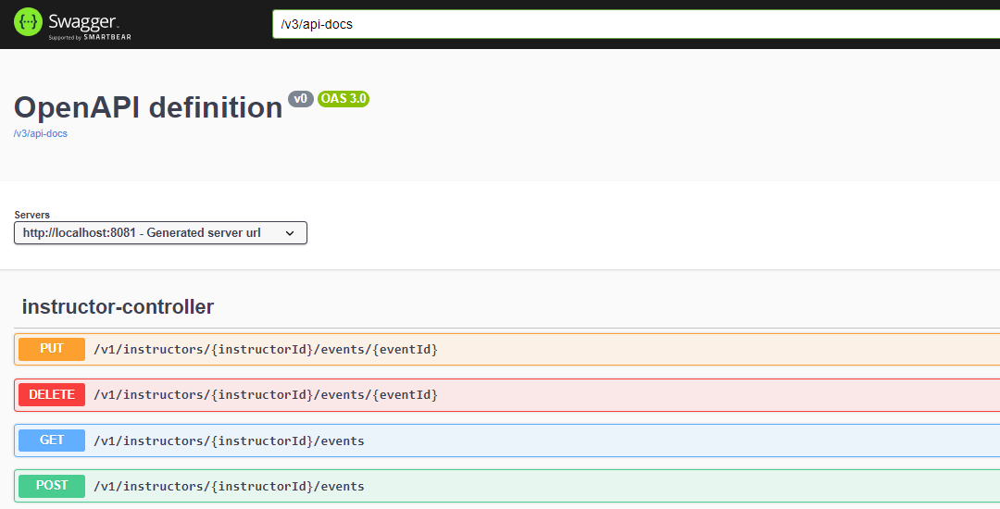
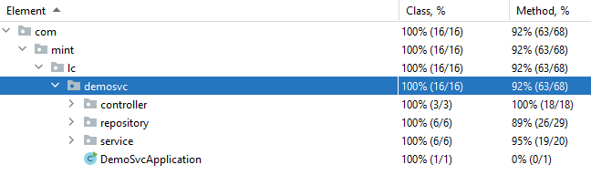
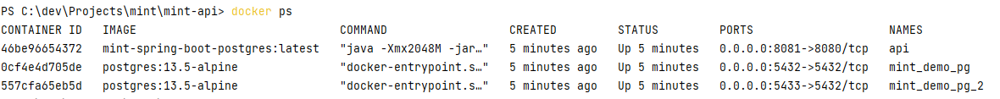

# Read Me First
Mint exercise project.

The architecture of the api is base on controller-service-repository pattern like is showed in the image bellow:



### Tech stack and reference Documentation
For further reference, please consider the following sections:

* [Official Apache Maven documentation](https://maven.apache.org/guides/index.html)
* [Spring Boot Maven Plugin Reference Guide](https://docs.spring.io/spring-boot/docs/3.2.5/maven-plugin/reference/html/)
* [Create an OCI image](https://docs.spring.io/spring-boot/docs/3.2.5/maven-plugin/reference/html/#build-image)
* [Spring Web](https://docs.spring.io/spring-boot/docs/3.2.5/reference/htmlsingle/index.html#web)
* [Spring Data JPA](https://docs.spring.io/spring-boot/docs/3.2.5/reference/htmlsingle/index.html#data.sql.jpa-and-spring-data)
* [Spring Boot Actuator](https://docs.spring.io/spring-boot/docs/3.2.5/reference/htmlsingle/index.html#actuator)
* [Liquibase Migration](https://docs.spring.io/spring-boot/docs/3.2.5/reference/htmlsingle/index.html#howto.data-initialization.migration-tool.liquibase)

## Features
Additionally, we can find some interesting points to cover as a quality attributes:

* Persisting of data: Postgresql is the database used for the project. In the next steps, it will show you how to start it.


* Database control versioning: Based on liquibase. In order to facilitate the spin up and to have control over the database changes, you can add more xml changesets to the folder resources/db/changelogs.
By default, the project spins up with the following test data:
  - Instructor: instructors with codes: 111, 222 and 333
  - Event Types: mintType (default type), abc1, abc2, googleType

* The user can see the overlapping events
* Extend to any number of months and allow to navigate between months
* Depict the schedules graphically by a graphic screen
* Open api documentation. Once the project runs, you can open a tool for calling the endpoints easily http://localhost:8081/swagger-ui/index.html:

* Test coverage higher than 80%

* And an additional feature that will be showed at the end of the demo...

## Getting Started
The following was discovered as part of building this project:

* Start a new console and clone the project so:
```
git clone https://github.com/lcarlosrincon/mint-api.git
```
* Go to the project root (cd mint-api)
* Start the database: it's mandatory to start with docker, just run the following commnad:
``` docker
docker compose up -d db2
```

### Option 1: springboot-run
* Run it with maven through spring-boot plugin:
```
.\mvnw spring-boot:run
```
* Check the project health open a new tab in the browser and put the url: http://localhost:8081/actuator/health
You should see status up in the response.
### Option 2: docker
* The application will be running on docker with the configuration defined on docker-compose file.
* In order to run it, type the following command on your console:
``` docker
docker compose up -d
```
It could take a few minutes because, first, it's building the project with the Dockerfile multistage option and it includes the maven dependencies downloading. 
* You can see a console output like this:

* If you modified your code and you want to run it on docker, a new build will be necessary, you must run:
``` docker
docker compose up -d db2 --build api
```

### Guides
The following guides illustrate how to use some features concretely:

* [Building a RESTful Web Service](https://spring.io/guides/gs/rest-service/)
* [Serving Web Content with Spring MVC](https://spring.io/guides/gs/serving-web-content/)
* [Building REST services with Spring](https://spring.io/guides/tutorials/rest/)
* [Accessing Data with JPA](https://spring.io/guides/gs/accessing-data-jpa/)
* [Building a RESTful Web Service with Spring Boot Actuator](https://spring.io/guides/gs/actuator-service/)
